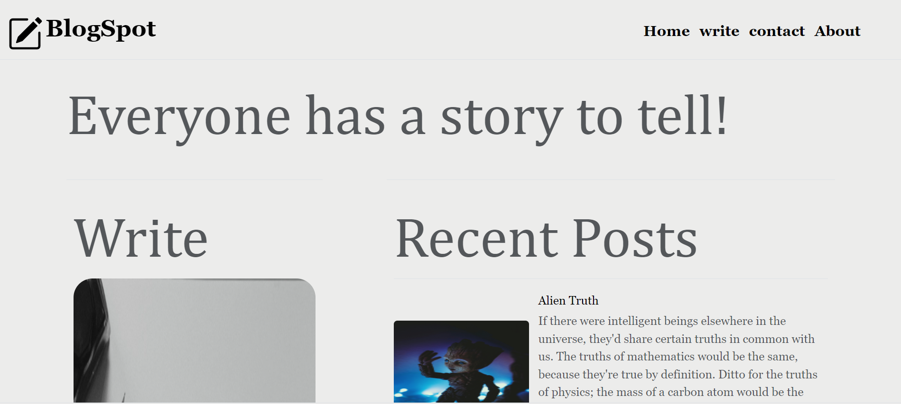

## Blog Spot

<!--  -->
<div align="center"> </div>

#### A dynamic blog platform where users can share their thoughts, ideas, and experiences on various topics. With a simple and user-friendly design, it encourages creativity and expression, making it an ideal space for writers and bloggers.

## Features

 - Displays blogs.
 - Accepts new blogs.
 - Edit and Delete blogs.
 - Responsive design that works on all devices.
 - Interactive sections for easy navigation.
 - Hosted on Render.


## Tech Stack

<a href="https://skillicons.dev">
   
</a>


 **Hosting**: Render
  

## Live Demo

Check out the live version of the website here: <a href="https://blog-spot-website.onrender.com/" > Novel Notes </a> 

## Running Locally

1. Clone this repo:

```bash
git clone  https://github.com/SulemJ/Blog-spot-website.git
```
2. Navigate to the project directory:

```bash
cd Blog-spot-website
```
3. Make sure you have nodeJs and npm installed

4. install the dependencies using `npm install`.

     - First go to quieries.sql 
     - copy and paste all the quieries in postgres pgadmin.
     - Go to index.js line 12 and 13 and put your own postgres username and password.

5. Run the server: `node index.js`.

6. Go to http://localhost:3000
